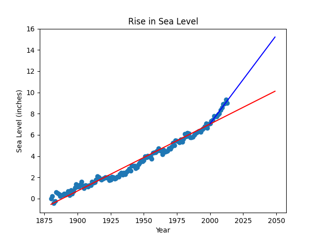

# 🌊 Sea Level Predictor

Welcome to the **Sea Level Predictor** project! This repository contains a Python-based analysis of global average sea level changes since 1880, along with predictions for future trends through 2050. Dive in to explore how data visualization and regression analysis can uncover critical insights. 🚀

---

## 📖 Project Overview

This project involves:
- 📊 **Analyzing historical data** on global average sea level changes.
- 📈 **Visualizing trends** using scatter plots and lines of best fit.
- 🔮 **Predicting future sea levels** based on historical trends.

We leverage Python libraries like **Pandas**, **Matplotlib**, and **Scipy** to make data-driven predictions.

---

## 📂 Files in This Repository

- `sea_level_predictor.py`: Main script where the project logic is implemented.
- `main.py`: Testing script to run and validate the visualizations.
- `test_module.py`: Contains unit tests for the project.
- `epa-sea-level.csv`: Dataset containing sea level data from 1880 to 2014.
- `sea_level_plot.png`: Generated plot showcasing the analysis.

---

## 🛠️ Features

1. **Data Loading**: Import and process the `epa-sea-level.csv` dataset.
2. **Scatter Plot**: Visualize historical data with a scatter plot.
3. **First Line of Best Fit**:
   - Analyzes data from 1880 to 2014.
   - Predicts sea levels through 2050.
4. **Second Line of Best Fit**:
   - Analyzes data from 2000 to 2014.
   - Predicts sea levels through 2050.
5. **Visualization**:
   - Creates a clear, labeled plot with two prediction lines.

---

## 🧰 Technologies Used

- **Python** 🐍
- **Pandas**: Data manipulation and analysis.
- **Matplotlib**: Data visualization.
- **Scipy**: Statistical analysis.

---

## 🚀 Getting Started

### Prerequisites

Ensure you have Python installed and the required libraries:
```bash
pip install pandas matplotlib scipy
```

### Running the Project

1. Clone the repository:
   ```bash
   git clone https://github.com/Alogyn/data-analysis-with-python-projects
   ```

2. Navigate to the project directory:
   ```bash
   cd data-analysis-with-python-projects/boilerplate-sea-level-predictor
   ```

3. Run the analysis:
   ```bash
   python main.py
   ```

---

## 📊 Expected Output

The script generates a plot that:
- Shows historical data as a scatter plot.
- Displays two lines of best fit predicting sea levels through 2050.
- Includes proper labels and titles:
  - **X-axis**: Year
  - **Y-axis**: Sea Level (inches)
  - **Title**: Rise in Sea Level

### Example Plot 📉


---

## 🧪 Testing

Run unit tests to validate your implementation:
```bash
python test_module.py
```

---

## 📅 Timeline

1. **Data Analysis**: Load and explore the dataset.
2. **Visualization**: Create scatter plot and lines of best fit.
3. **Testing**: Validate output using unit tests.
4. **Submission**: Save and submit the plot.

---

## 📜 License

This project is part of the freeCodeCamp curriculum and follows their terms of use.

---

## 🤝 Acknowledgments

- **freeCodeCamp**: For providing the project and starter code.
- **US Environmental Protection Agency**: For the dataset.